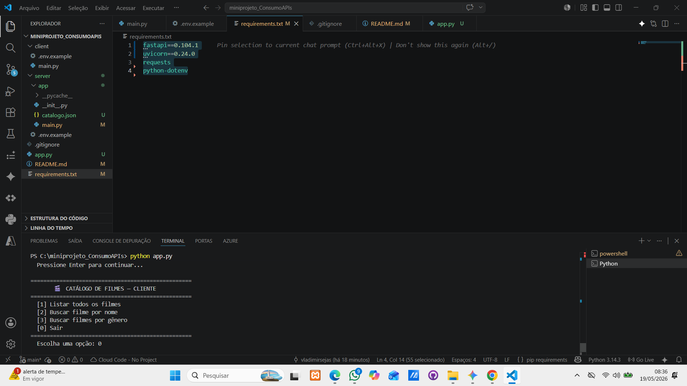
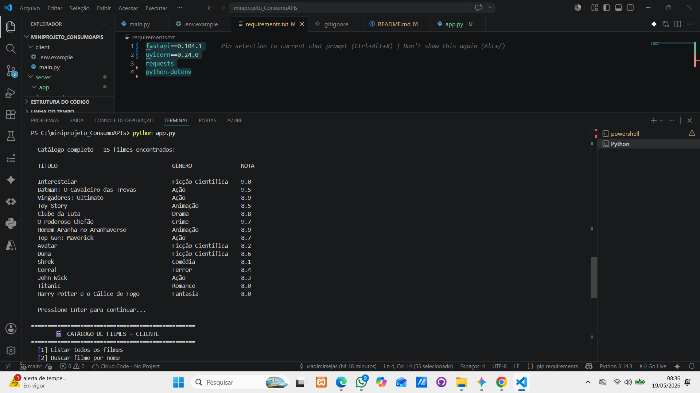
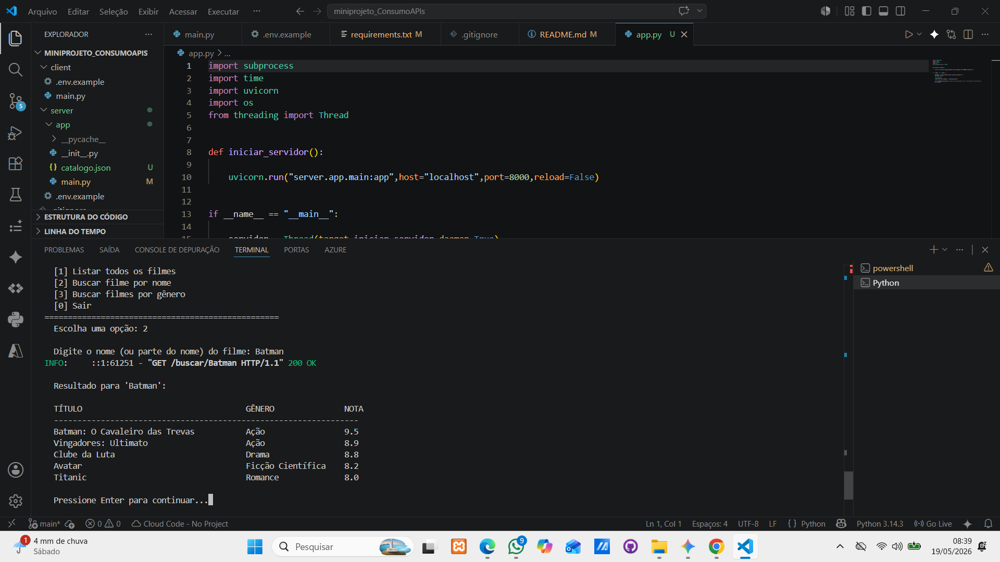
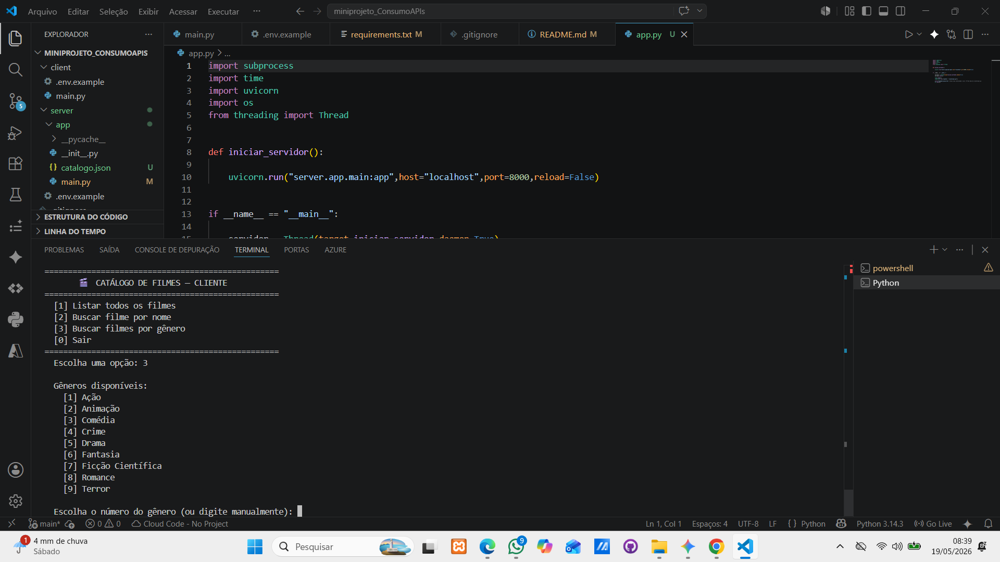
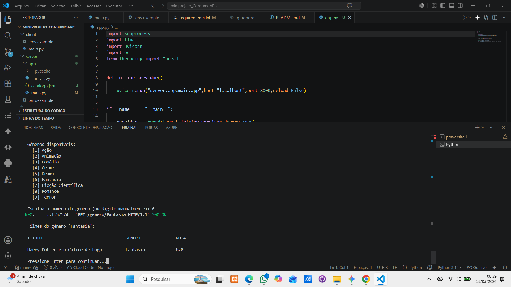

# Mini Projeto API - Consumo de APIs

Projeto desenvolvido para a disciplina de Inteligência Artificial da Fatec Rio Claro, 2º Semestre de 2025.

## Descrição

Este projeto implementa um servidor de API utilizando FastAPI e um cliente em Python que consome essa API. O servidor disponibiliza um catálogo de filmes com funcionalidades de listagem, busca por nome e filtragem por gênero. O cliente acessa essas funcionalidades via requisições HTTP e exibe os resultados no terminal.

## Bibliotecas utilizadas

O projeto utiliza as seguintes bibliotecas externas. FastAPI é o framework utilizado para construir o servidor da API de forma rápida e com tipagem automática. Uvicorn é o servidor ASGI responsável por executar a aplicação FastAPI. Requests é a biblioteca utilizada pelo cliente para realizar as requisições HTTP ao servidor. Python-dotenv é utilizada para carregar variáveis de ambiente a partir do arquivo .env, como a URL base do servidor.

Para instalar todas as dependências de uma vez, execute o comando abaixo no terminal:

    pip install -r requirements.txt

## Estrutura do projeto

O projeto está organizado em duas partes principais. A pasta server contém a lógica da API, com o arquivo main.py onde estão definidas as rotas e o arquivo catalogo.json com os dados dos filmes. A pasta client contém o arquivo main.py responsável por consumir a API e exibir os resultados no terminal.

## Como executar

Para rodar o projeto completo, basta executar o arquivo app.py na raiz do projeto com o comando abaixo. Ele inicializa o servidor automaticamente e em seguida abre o menu do cliente no terminal.

    python app.py

Caso prefira rodar separadamente, abra dois terminais. No primeiro, inicie o servidor com o comando uvicorn server.app.main:app --host localhost --port 8000. No segundo, execute o cliente com python client/main.py.

## Variáveis de ambiente

O cliente utiliza um arquivo .env para configurar a URL base do servidor. Um modelo está disponível no arquivo .env.example dentro da pasta client. Copie esse arquivo, renomeie para .env e ajuste se necessário. Por padrão o valor já está configurado para http://localhost:8000, que funciona para execução local.

## Endpoints disponíveis

O servidor expõe três endpoints. O endpoint GET /filmes retorna todos os filmes do catálogo. O endpoint GET /buscar/{nome} realiza uma busca por nome, aceitando nomes parciais ou aproximados. O endpoint GET /genero/{genero} filtra os filmes pelo gênero informado.

## Demonstração

Ao iniciar o projeto com python app.py, o cliente exibe um menu interativo no terminal com as opções disponíveis para consulta ao catálogo.

Ao selecionar a opção 1, o cliente realiza uma requisição GET /filmes ao servidor e exibe todos os filmes cadastrados no catálogo, com título, gênero e nota.

Ao selecionar a opção 2, o usuário digita o nome ou parte do nome de um filme. O cliente envia uma requisição GET /buscar/{nome} e o servidor retorna os filmes correspondentes, incluindo resultados com nomes aproximados.

Ao selecionar a opção 3, o cliente exibe os gêneros disponíveis para escolha. O usuário seleciona um número ou digita o gênero manualmente, e o cliente envia uma requisição GET /genero/{genero} ao servidor.

Após a seleção do gênero, o servidor retorna os filmes correspondentes e o cliente os exibe formatados no terminal com título, gênero e nota.

## Integrantes

O servidor foi desenvolvido pelo integrante responsável pelo backend, incluindo o arquivo server/app/main.py, o catalogo.json e o app.py. O cliente, o README e as configurações de ambiente foram desenvolvidos pelo segundo integrante, com contribuição via pull request no repositório.
